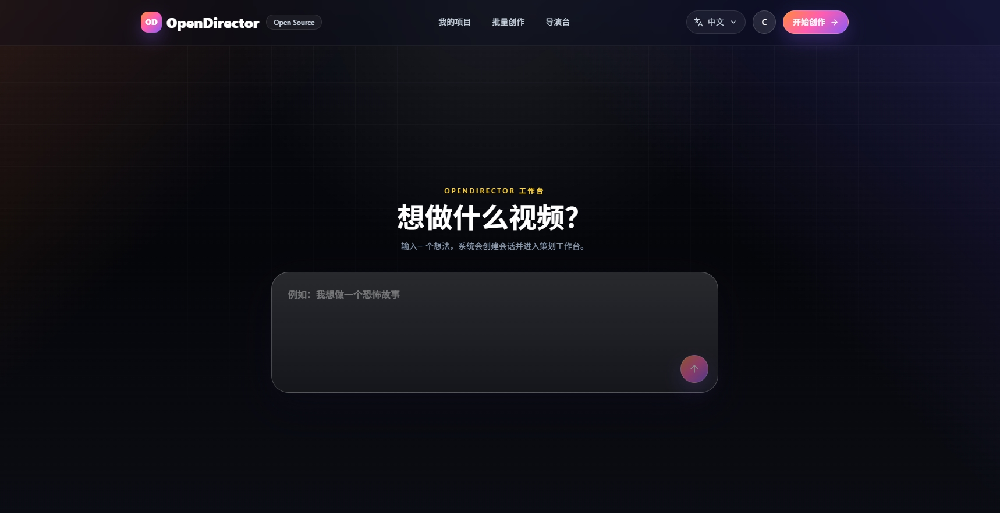
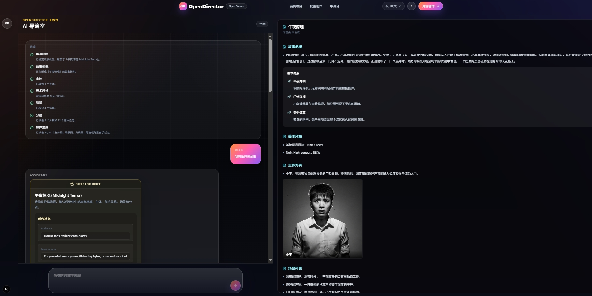
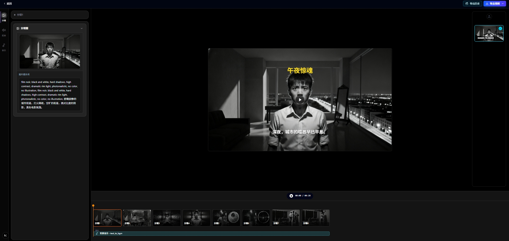

# OpenDirector

> 开源 AI 视频工作室 — 9 个 AI agent 协作，从一句话生成完整视频（含研究、分镜、配音、配乐）。

[English](./README.md) | [中文](./README_CN.md)

🌐 **官网地址**: [https://od.seme.cc](https://od.seme.cc)

---

## 什么是 OpenDirector？

OpenDirector 是一个 **Docker 优先、可自托管** 的 AI 视频制作工作室。用一句话描述你的想法，9 个专业 AI agent 会协作生成完整视频 — 包含可选网页研究、分镜脚本、角色设计、配音、背景音乐和渲染输出。

只需 `docker compose up` 即可开始创作。

---

## 界面预览

| AI 导演对话 | 批量生产 |
|:---:|:---:|
|  |  |
| **创作编辑器** | **分镜预览** |
|  |  |

## Demo Videos

<table>
  <tr>
    <td width="50%">
      <video src="https://github.com/user-attachments/assets/8cdf67d1-f1d3-460e-9c62-43d26c5ab20e" controls muted playsinline width="100%"></video>
    </td>
    <td width="50%">
      <video src="https://github.com/user-attachments/assets/0ac73afe-116a-4ba0-9f8a-769c55d78b47" controls muted playsinline width="100%"></video>
    </td>
  </tr>
  <tr>
    <td width="50%">
      <video src="https://github.com/user-attachments/assets/2fb8f97e-e3cc-4ce7-ae4d-7dced1689197" controls muted playsinline width="100%"></video>
    </td>
    <td width="50%">
      <video src="https://github.com/user-attachments/assets/645c9f16-c64f-4e1c-a766-0b03b9837d9b" controls muted playsinline width="100%"></video>
    </td>
  </tr>
</table>


---

## 工作原理

```
你的想法
   |
   v
[研究agent] --> [脚本agent] --> [美术风格agent] --> [分镜agent]
                                                |
                                                v
[角色agent] --> [场景agent] --> [配音agent] --> [配乐agent]
                                                |
                                                v
                                          [媒体agent]
                                                |
                                                v
                                      [渲染 Worker] --> 最终视频
```

9 个专业agent组成流水线：

1. **研究agent** — 在需要时使用 OpenAI `web_search_preview` 检索已知故事、事实引用、品牌、产品和公开资料
2. **脚本agent** — 生成故事大纲和叙事结构，并在有研究笔记时参考使用
3. **美术风格agent** — 从 34 种内置风格中选择（如 Futuristic Neon Noir、Dreamscape Watercolor Anime、Documentary Realism 等）
4. **分镜agent** — 将故事拆分为场景，生成镜头描述和台词
5. **角色agent** — 设计角色形象，生成视觉提示词，分配配音
6. **场景agent** — 为每个场景创建环境概念图
7. **配音agent** — 根据角色性格和性别匹配 TTS 语音
8. **配乐agent** — 根据故事氛围生成背景音乐
9. **媒体agent** — 编排图片/配音/音乐生成最终素材

每个agent都是一个 LangGraph 节点，实时流式输出 — 你可以看着方案一步步构建完成。
共享图状态现在包含 `research` 字段，用于保存研究笔记、注意事项和来源；脚本agent 会消费这些笔记，但不会复制来源文本。

---

## 功能特性

### 创意模式（AI 导演全流程）

- 输入一句话，AI 导演自动生成完整方案：策划、故事、分镜、配音、配图、BGM
- 针对已知故事、事实引用、品牌、产品和公开信息，支持可选网页研究
- **34 种内置美术风格**，涵盖 9 大类：电影感、商业、未来感、复古、动漫、3D、插画、写实、实验性
- **AI 自动生成故事脚本**，支持手动编辑调整
- **AI 配音**，多种音色可选，支持实时试听
- **AI 背景音乐**，根据故事氛围自动生成
- **分镜预览**，图片 + 配音 + BGM 同步播放
- 支持 **16:9 / 9:16 / 1:1** 画面比例
- 支持 **480p / 720p / 1080p** 导出

### 批量模式（短视频批量生产）

- 输入主题，**AI 自动生成多个脚本**，批量生产短视频
- 支持 **视频片段时长设置**（2-10秒），灵活控制素材切换节奏
- 支持 **中文和英文** 视频文案
- 支持 **多种语音合成**，内置 Edge TTS（免费），可实时试听
- 支持 **字幕生成**，可调整字体、大小、颜色、位置、描边
- 支持 **背景音乐**，随机或指定本地音乐文件，可设置音量
- 视频素材来源 **高清无版权**（Pexels / Pixabay），也支持本地素材
- 一次生成 **多个输出变体**，选最满意的导出

### 通用特性

- 支持 **多种 AI 模型接入**：OpenAI、Google Gemini、DeepSeek、通义千问、MiniMax、Ollama 等
- 支持 **多种媒体生成提供商**：AiHubMix、WaveSpeed，通过环境变量一键切换
- **Docker 一键部署**，`docker compose up` 即可运行
- **完整自托管**，数据在你自己的服务器上
- 支持 **中英文界面**

> 推荐使用 DeepSeek 作为大模型提供商（国内可直接访问，注册送额度）。媒体生成推荐 AiHubMix（注册送免费额度）。

---

## 快速开始

### 环境要求

- Docker & Docker Compose
- （可选）Node.js 20+ 用于本地开发

### 一键启动

```bash
git clone https://github.com/seme-org/open-director.git
cd open-director
cp .env.example .env
# 编辑 .env 填入你的 API key
docker compose up --build
```

然后打开 **http://localhost:3000**。

### 默认服务

| 服务 | 地址 | 凭据 |
|------|------|------|
| 应用 | http://localhost:3000 | — |
| MinIO 控制台 | http://localhost:9001 | `opendirector` / `opendirector-secret` |
| MySQL | localhost:3307 | 见 `.env.prod` |
| Redis | localhost:6379 | — |

---

## 媒体生成

OpenDirector 使用 WaveSpeed 进行图片生成。角色图和场景底图使用文生图模型；带角色参考图的分镜图必须使用 image-to-image/edit 模型，这样 reference image 才会被模型按预期使用。

```env
WAVESPEED_API_KEY="your-wavespeed-key"
WAVESPEED_IMAGE_MODEL="nano-banana"
WAVESPEED_IMAGE_TO_IMAGE_MODEL="nano-banana-2-edit"
EDGE_TTS_VOICE="zh-CN-XiaoxiaoNeural"
```

不要把 `WAVESPEED_IMAGE_TO_IMAGE_MODEL` 设置为 `nano-banana`：这个别名会走文生图端点，可能忽略角色参考图。

语音使用本地 Edge TTS，背景音乐使用 `assets/bgm/default/` 中的本地曲目。

---

## LLM 配置

LLM 用于 recipe 生成、脚本编写和 AI 导演。使用 OpenAI 兼容的 API 格式。

```env
OPENAI_API_KEY="your-key"
OPENAI_BASE_URL="https://api.openai.com/v1"
OPENAI_MODEL="gpt-4o-mini"
```

LLM 使用 OpenAI 或 OpenAI 兼容端点。

---

## 本地开发

```bash
pnpm install
pnpm db:generate
pnpm dev
```

这会在 http://localhost:3000 启动 Next.js 开发服务器。

### 环境变量文件

| 文件 | 用途 |
|------|------|
| `.env.example` | 所有变量的文档模板 |
| `.env` | 本地机器覆盖配置（已 git 忽略） |
| `.env.prod` | Docker Compose 生产环境默认配置 |

---

## 架构

```
┌─────────────────────────────────────────────────┐
│                   Next.js 应用                   │
│  (App Router, React 19, TypeScript, Tailwind)   │
└────────┬──────────┬──────────┬──────────────────┘
         │          │          │
    ┌────▼───┐ ┌────▼───┐ ┌───▼────┐
    │ MySQL  │ │ Redis  │ │ MinIO  │
    │   8.4  │ │   7    │ │  S3    │
    └────────┘ └────┬───┘ └────────┘
                    │
              ┌─────▼──────┐
              │   Worker   │
              │ (FFCreator) │
              └────────────┘
```

### Monorepo 结构

```
open-director/
├── apps/
│   ├── web/          # Next.js 前端 + API 路由 + 9 个 AI agent
│   └── render/       # BullMQ 渲染 Worker (FFCreator)
├── assets/
│   └── fonts/        # 字幕渲染字体
├── prisma/
│   └── schema.prisma # 数据库 Schema（含 voices、art_styles、bgms 等）
├── docker-compose.yml
└── package.json
```

### 媒体提供商架构

```
apps/web/src/server/agent/
├── media-provider.ts          # 类型 + 工厂 + 编排器
├── schemas/
│   └── research.ts            # 研究笔记、注意事项和来源 Schema
├── voices.ts                  # TTS 语音目录（从数据库加载）
├── art-styles.ts              # 美术风格目录（从数据库加载）
├── providers/
│   ├── wavespeed.ts           # WaveSpeed 实现
│   ├── aihubmix.ts            # AiHubMix 实现
│   ├── local-bgm.ts           # 本地 BGM（从数据库随机选取）
│   └── wavespeed.test.ts      # 提供商测试
└── graph/nodes/recipe/        # 9 个 LangGraph agent 节点
```

### 技术栈

| 层级 | 技术 |
|------|------|
| 前端 | Next.js 16, React 19, TypeScript, Tailwind CSS 4 |
| AI | LangChain + LangGraph |
| 数据库 | Prisma + MySQL 8.4 |
| 队列 | BullMQ + Redis |
| 存储 | MinIO（兼容 S3） |
| 渲染 | FFCreator（基于 FFmpeg） |
| 认证 | 自定义凭据（Prisma 支持） |
| 国际化 | next-intl（英文 + 中文） |

---

## 路由

### 页面

| 路由 | 描述 |
|------|------|
| `/` | 落地页 |
| `/chat` | AI 导演工作室 |
| `/chat/[id]` | 已有对话 |
| `/creation/[id]` | 创作编辑器（分镜预览 + 导出） |
| `/space` | 用户工作区 |
| `/batch` | 批量视频生产 |
| `/signin`、`/signup` | 登录注册 |

### API 端点

| 端点 | 描述 |
|------|------|
| `/api/agent-chat` | AI 导演对话（流式） |
| `/api/threads` | 会话 CRUD |
| `/api/messages` | 消息 CRUD |
| `/api/assets` | 素材管理 |
| `/api/recipes/thread/[id]` | Recipe 操作 |
| `/api/uploads/init`、`/complete` | 文件上传 |
| `/api/render/quick-concat` | 视频渲染 |
| `/api/jobs/[id]` | 任务状态 |

---

## 配置

### 必需

| 变量 | 默认值 | 描述 |
|------|--------|------|
| `DATABASE_URL` | 在 `.env.prod` 中设置 | MySQL 连接字符串 |
| `REDIS_HOST` | `redis` | Redis 主机 |
| `REDIS_PORT` | `6379` | Redis 端口 |
| `S3_ENDPOINT` | `http://minio:9000` | S3 兼容存储端点 |
| `S3_ACCESS_KEY_ID` | `opendirector` | S3 访问密钥 |
| `S3_SECRET_ACCESS_KEY` | `opendirector-secret` | S3 密钥 |
| `S3_BUCKET` | `open-director` | S3 存储桶名称 |

### 媒体生成

| 变量 | 默认值 | 描述 |
|------|--------|------|
| `WAVESPEED_API_KEY` | — | WaveSpeed API 密钥 |
| `WAVESPEED_IMAGE_MODEL` | `nano-banana` | 角色图和场景底图使用的文生图模型 |
| `WAVESPEED_IMAGE_TO_IMAGE_MODEL` | `nano-banana-2-edit` | 带角色参考图的分镜图使用的 image-to-image/edit 模型 |
| `EDGE_TTS_VOICE` | `zh-CN-XiaoxiaoNeural` | 本地 Edge TTS 语音 |

### LLM

| 变量 | 默认值 | 描述 |
|------|--------|------|
| `OPENAI_API_KEY` | — | OpenAI 兼容 API 密钥 |
| `OPENAI_BASE_URL` | — | API 基础 URL |
| `OPENAI_MODEL` | `gpt-4o-mini` | 模型名称 |

### 批量模式

| 变量 | 默认值 | 描述 |
|------|--------|------|
| `PEXELS_API_KEY` | — | Pexels API 密钥（库存视频） |
| `PIXABAY_API_KEY` | — | Pixabay API 密钥（库存视频） |
| `BATCH_TTS_PROVIDER` | `edge` | 批量 TTS 提供商 |
| `BATCH_EDGE_TTS_VOICE` | `zh-CN-XiaoxiaoNeural` | 批量 Edge TTS 语音 |

---

## 部署

### Docker Compose（推荐）

```bash
docker compose up -d --build
```

这会启动所有服务：MySQL、Redis、MinIO、Web 应用和渲染 Worker。

### 手动部署

```bash
pnpm install
pnpm db:generate
pnpm db:migrate
pnpm build
pnpm start
```

---

## 贡献

1. Fork 本仓库
2. 创建功能分支：`git checkout -b feature/my-feature`
3. 提交更改：`git commit -m "feat: add my feature"`
4. 推送分支：`git push origin feature/my-feature`
5. 提交 Pull Request

### 开发规范

- 提交前运行 `pnpm typecheck`
- 运行 `pnpm lint` 检查代码风格
- 使用 [Conventional Commits](https://www.conventionalcommits.org/) 规范提交信息

---

## 后续计划

- [ ] AI 数字人 — 支持数字人形象，口播视频自动生成
- [ ] 漫剧增强 — 支持漫画分格动画、角色表情切换、镜头特效
- [ ] 多语言配音 — 扩展 TTS 语音库，支持更多语言
- [ ] AI 数字人增强 — 支持自定义形象、表情驱动、实时口播
