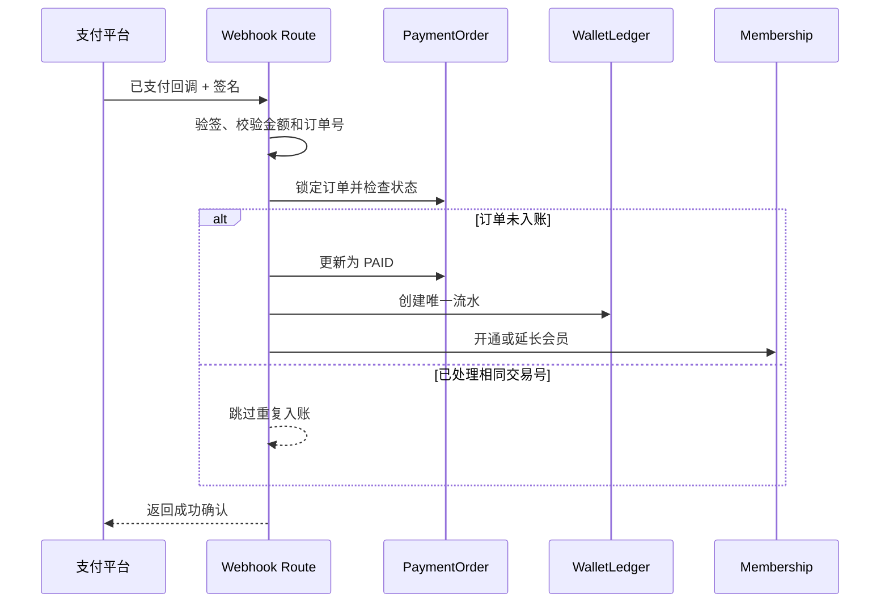

# 个人中心余额与充值后端接口对接文档

本文档定义 OpenDirector 个人中心需要的后端接口、数据结构和业务约束，供后端直接实现，并作为前后端联调与验收依据。

> **当前状态：** 前端余额卡显示静态值 `¥0.00`；现有 Prisma Schema 没有钱包、余额账本、支付订单或会员订阅模型；本文定义的接口均为待后端新增接口。

## 交付范围

后端需要提供以下能力：

1. 返回个人中心概览数据，包括余额、创作统计和项目产出序列。
2. 返回会员套餐列表及当前用户会员状态。
3. 创建充值或会员购买订单，并保证请求幂等。
4. 查询支付订单状态。
5. 处理支付平台回调，在数据库事务中入账和开通会员。
6. 提供可审计的余额流水，禁止直接覆盖余额。
7. 配置生成视频所需的 LLM、图片、配音、素材、存储和渲染服务。
8. 维护现有视频生成接口，并将生成消耗接入 Token 账本。

推荐接口清单：

| 方法   | 路径                                  | 用途                     | 鉴权               |
| ------ | ------------------------------------- | ------------------------ | ------------------ |
| `GET`  | `/api/v1/profile/dashboard`           | 获取个人中心全部动态数据 | 登录 Cookie        |
| `GET`  | `/api/v1/membership/plans`            | 获取可购买会员套餐       | 可公开             |
| `POST` | `/api/v1/payment-orders`              | 创建充值或会员订单       | 登录 Cookie + CSRF |
| `GET`  | `/api/v1/payment-orders/{orderId}`    | 查询当前用户的订单状态   | 登录 Cookie        |
| `GET`  | `/api/v1/wallet/ledger`               | 查询当前用户余额流水     | 登录 Cookie        |
| `POST` | `/api/v1/payment-webhooks/{provider}` | 接收支付平台回调         | 平台签名           |
| `POST` | `/api/agent-chat`                     | 生成导演方案和媒体，SSE  | 登录 Cookie        |
| `POST` | `/api/render/quick-concat`            | 提交最终视频渲染任务     | 登录 Cookie        |
| `GET`  | `/api/jobs/{jobId}`                   | 查询渲染进度与结果       | 登录 Cookie        |
| `POST` | `/api/batches/{batchId}/start`        | 启动批量视频生产         | 登录 Cookie        |

## 通用协议

### 鉴权

项目现有认证使用名为 `open_director_session` 的 HttpOnly Cookie。浏览器同源请求无需传递用户 ID，后端必须通过 `getCurrentUser()` 获取当前用户。

禁止接受以下身份来源作为授权依据：

- Query 参数中的 `userId`
- JSON Body 中的 `userId`
- 客户端自定义的 `X-User-Id`

未登录统一返回：

```http
HTTP/1.1 401 Unauthorized
Content-Type: application/json
Cache-Control: no-store
```

```json
{
  "error": {
    "code": "UNAUTHORIZED",
    "message": "请先登录",
    "requestId": "req_01J6M9M4K9Y32V7P4J8F6A1C2D"
  }
}
```

### 数据规则

| 类型       | 规则                                   | 示例                       |
| ---------- | -------------------------------------- | -------------------------- |
| 金额       | 整数，单位为分，禁止浮点数             | `2990` 表示 `¥29.90`       |
| Token 数量 | 十进制字符串，避免未来超过 JS 安全整数 | `"120000000"`              |
| 比例       | 整数基点，10000 表示 100%              | `9240` 表示 92.4%          |
| 时间       | ISO 8601 UTC                           | `2026-08-18T01:30:00.000Z` |
| ID         | 服务端生成的不透明字符串               | `cm5order7z0001abc123`     |
| 时区       | IANA 时区名称                          | `Asia/Shanghai`            |

所有个人账户接口必须返回：

```http
Cache-Control: no-store
```

### 成功与错误格式

成功响应使用 `data` 包裹：

```json
{
  "data": {}
}
```

错误响应使用统一结构：

```json
{
  "error": {
    "code": "INVALID_ARGUMENT",
    "message": "请求参数不正确",
    "requestId": "req_01J6M9M4K9Y32V7P4J8F6A1C2D",
    "details": {
      "field": "planCode"
    }
  }
}
```

通用错误码：

| HTTP | code                           | 场景                       |
| ---- | ------------------------------ | -------------------------- |
| 400  | `INVALID_ARGUMENT`             | 参数格式或取值错误         |
| 401  | `UNAUTHORIZED`                 | 未登录或会话失效           |
| 403  | `FORBIDDEN`                    | 无权访问该订单或流水       |
| 404  | `NOT_FOUND`                    | 订单或套餐不存在           |
| 409  | `ORDER_CONFLICT`               | 幂等键对应了不同请求       |
| 422  | `PLAN_UNAVAILABLE`             | 套餐已下架或不满足购买条件 |
| 429  | `RATE_LIMITED`                 | 请求过于频繁               |
| 500  | `INTERNAL_ERROR`               | 未分类服务端错误           |
| 503  | `PAYMENT_PROVIDER_UNAVAILABLE` | 支付平台暂不可用           |

## 获取个人中心数据

### GET `/api/v1/profile/dashboard`

一次返回首屏需要的用户、钱包、统计、产出序列和会员状态，避免前端并发请求多个接口。

Query 参数：

| 名称       | 类型               | 必填 | 默认值          | 说明         |
| ---------- | ------------------ | ---- | --------------- | ------------ |
| `range`    | `7d \| 30d \| 90d` | 否   | `30d`           | 统计周期     |
| `timezone` | string             | 否   | `Asia/Shanghai` | 产出分组时区 |

请求示例：

```http
GET /api/v1/profile/dashboard?range=30d&timezone=Asia%2FShanghai HTTP/1.1
Cookie: open_director_session=REDACTED
Accept: application/json
```

响应示例：

```json
{
  "data": {
    "user": {
      "id": "cm5user7z0001abc123",
      "displayName": "粤叔",
      "email": "user@example.com",
      "imageUrl": null,
      "joinedAt": "2026-08-17T05:20:00.000Z"
    },
    "wallet": {
      "currency": "CNY",
      "availableAmountMinor": 0,
      "tokenBalance": "0",
      "updatedAt": "2026-08-18T01:30:00.000Z"
    },
    "stats": {
      "creationDurationSeconds": 88560,
      "assetCount": 458,
      "projectCompletionRateBps": 9240,
      "completedProjectCount": 36,
      "deltas": {
        "creationDurationBps": 840,
        "assetCountBps": 330,
        "projectCompletionRateBps": 410,
        "completedProjectCountBps": 1280
      }
    },
    "outputSeries": [
      { "period": "2026-01", "count": 28 },
      { "period": "2026-02", "count": 51 },
      { "period": "2026-03", "count": 35 },
      { "period": "2026-04", "count": 16 },
      { "period": "2026-05", "count": 43 },
      { "period": "2026-06", "count": 22 },
      { "period": "2026-07", "count": 25 },
      { "period": "2026-08", "count": 30 }
    ],
    "membership": {
      "status": "ACTIVE",
      "planCode": "QUARTER_90D",
      "planName": "季度会员",
      "startedAt": "2026-08-01T00:00:00.000Z",
      "expiresAt": "2026-10-30T00:00:00.000Z",
      "autoRenew": false
    }
  }
}
```

字段映射：

| 后端字段                         | 前端位置         | 前端显示规则                             |
| -------------------------------- | ---------------- | ---------------------------------------- |
| `wallet.availableAmountMinor`    | 顶部“余额”卡     | 除以 100 后用 `Intl.NumberFormat` 格式化 |
| `stats.creationDurationSeconds`  | “创作时长”卡     | 转换成小时，保留一位小数                 |
| `stats.assetCount`               | “素材资产”卡     | 整数显示                                 |
| `stats.projectCompletionRateBps` | “项目完成率”卡   | 除以 100 后添加 `%`                      |
| `stats.completedProjectCount`    | “项目产出”累计数 | 整数显示                                 |
| `outputSeries`                   | 项目产出柱状图   | 按数组顺序绘制                           |
| `membership`                     | 左侧会员信息     | 显示套餐和有效期                         |

业务要求：

- 用户第一次访问且没有钱包记录时，后端应在事务内创建零余额钱包，不能返回 404。
- `wallet`、`stats` 和 `outputSeries` 必须全部限定为当前会话用户的数据。
- 统计查询失败时返回明确错误，不能把数据库错误静默转换为伪造统计值。
- `outputSeries` 缺失周期应补零，保证图表轴稳定。
- `range=30d` 时允许按日返回；当前 UI 若按 12 个周期展示，后端也可返回最近 12 个自然月，但必须在 `period` 中明确年月。

## 获取会员套餐

### GET `/api/v1/membership/plans`

返回当前可售套餐，前端不应把价格、Tokens 数量和有效期写死在组件中。

响应示例：

```json
{
  "data": {
    "plans": [
      {
        "code": "TRIAL_7D",
        "name": "抢尝鲜会员",
        "priceMinor": 99,
        "currency": "CNY",
        "durationDays": 7,
        "tokenGrant": "7000000",
        "grantMode": "DAILY",
        "dailyTokenGrant": "1000000",
        "badge": "限时抢鲜",
        "imageUrl": "/images/membership-showcase/01-trial-member.png",
        "available": true,
        "sortOrder": 10
      },
      {
        "code": "QUARTER_90D",
        "name": "季度会员",
        "priceMinor": 2990,
        "currency": "CNY",
        "durationDays": 90,
        "tokenGrant": "30000000",
        "grantMode": "ONCE",
        "dailyTokenGrant": null,
        "badge": "轻度推荐",
        "imageUrl": "/images/membership-showcase/02-quarterly-member.png",
        "available": true,
        "sortOrder": 20
      },
      {
        "code": "HALF_YEAR_180D",
        "name": "半年会员",
        "priceMinor": 4990,
        "currency": "CNY",
        "durationDays": 180,
        "tokenGrant": "60000000",
        "grantMode": "ONCE",
        "dailyTokenGrant": null,
        "badge": "商家推荐",
        "imageUrl": "/images/membership-showcase/03-half-year-member.png",
        "available": true,
        "sortOrder": 30
      },
      {
        "code": "ANNUAL_365D",
        "name": "年度会员",
        "priceMinor": 7990,
        "currency": "CNY",
        "durationDays": 365,
        "tokenGrant": "100000000",
        "grantMode": "ONCE",
        "dailyTokenGrant": null,
        "badge": "长期划算",
        "imageUrl": "/images/membership-showcase/04-annual-member.png",
        "available": true,
        "sortOrder": 40
      },
      {
        "code": "LIFETIME_EARLY_BIRD",
        "name": "终身早鸟会员",
        "priceMinor": 9900,
        "currency": "CNY",
        "durationDays": null,
        "tokenGrant": "120000000",
        "grantMode": "ONCE",
        "dailyTokenGrant": null,
        "badge": "限时早鸟",
        "imageUrl": "/images/membership-showcase/05-lifetime-member.png",
        "available": true,
        "sortOrder": 50
      }
    ]
  }
}
```

后端必须按 `sortOrder` 升序返回。不可售套餐可以保留并返回 `available: false`，前端将禁用“立即开通”。

## 创建支付订单

### POST `/api/v1/payment-orders`

创建会员购买订单。该接口涉及资金，必须要求登录、校验 CSRF，并支持幂等。

请求头：

```http
Content-Type: application/json
Idempotency-Key: 4f68ae5d-9fa8-4993-90e4-7ac30b896f46
X-CSRF-Token: 84d23454f767a4d7e92b8dc94741739f
```

请求体：

```json
{
  "planCode": "QUARTER_90D",
  "paymentMethod": "WECHAT_PAY"
}
```

参数：

| 名称            | 类型                   | 必填 | 说明                           |
| --------------- | ---------------------- | ---- | ------------------------------ |
| `planCode`      | string                 | 是   | 套餐稳定编码，不接收客户端价格 |
| `paymentMethod` | `WECHAT_PAY \| ALIPAY` | 是   | 支付渠道                       |

成功响应：

```http
HTTP/1.1 201 Created
```

```json
{
  "data": {
    "orderId": "cm5order7z0001abc123",
    "status": "PENDING",
    "planCode": "QUARTER_90D",
    "amountMinor": 2990,
    "currency": "CNY",
    "paymentMethod": "WECHAT_PAY",
    "checkoutUrl": "https://pay.example.com/checkout/cm5order7z0001abc123",
    "expiresAt": "2026-08-18T01:45:00.000Z",
    "createdAt": "2026-08-18T01:30:00.000Z"
  }
}
```

幂等规则：

- 同一用户、同一 `Idempotency-Key`、相同请求体重复调用，返回同一订单。
- 同一幂等键对应不同 `planCode` 或 `paymentMethod`，返回 `409 ORDER_CONFLICT`。
- 幂等键至少保留 24 小时。
- 订单金额、Tokens 和有效期必须从服务端套餐记录读取，禁止使用客户端传入值。
- 对同一用户可限制同时只有一个同套餐的有效 `PENDING` 订单。

## 查询订单状态

### GET `/api/v1/payment-orders/{orderId}`

响应示例：

```json
{
  "data": {
    "orderId": "cm5order7z0001abc123",
    "status": "PAID",
    "planCode": "QUARTER_90D",
    "amountMinor": 2990,
    "currency": "CNY",
    "paidAt": "2026-08-18T01:33:20.000Z",
    "membershipActivated": true
  }
}
```

订单状态枚举：

| 状态       | 含义               | 前端行为                 |
| ---------- | ------------------ | ------------------------ |
| `PENDING`  | 等待支付           | 继续轮询，建议间隔 2 秒  |
| `PAID`     | 支付成功           | 停止轮询并刷新 dashboard |
| `CLOSED`   | 用户取消或订单关闭 | 停止轮询并提示已关闭     |
| `EXPIRED`  | 超过支付期限       | 停止轮询并允许重新下单   |
| `FAILED`   | 支付创建或确认失败 | 停止轮询并展示错误信息   |
| `REFUNDED` | 已退款             | 刷新余额、会员和账本     |

后端必须验证订单所属用户。其他用户访问时返回 404，避免泄露订单是否存在。

## 查询余额流水

### GET `/api/v1/wallet/ledger`

Query 参数：

| 名称     | 类型    | 必填 | 默认值 | 说明             |
| -------- | ------- | ---- | ------ | ---------------- |
| `cursor` | string  | 否   | 无     | 上一页返回的游标 |
| `limit`  | integer | 否   | 20     | 范围 1–100       |
| `type`   | string  | 否   | 无     | 按流水类型筛选   |

响应示例：

```json
{
  "data": {
    "items": [
      {
        "id": "cm5ledger7z0001abc123",
        "type": "PAYMENT_CREDIT",
        "amountMinor": 2990,
        "balanceAfterMinor": 2990,
        "referenceType": "PAYMENT_ORDER",
        "referenceId": "cm5order7z0001abc123",
        "description": "季度会员支付入账",
        "createdAt": "2026-08-18T01:33:20.000Z"
      }
    ],
    "nextCursor": null
  }
}
```

流水类型建议：

- `PAYMENT_CREDIT`
- `PURCHASE_DEBIT`
- `REFUND_CREDIT`
- `ADMIN_ADJUSTMENT_CREDIT`
- `ADMIN_ADJUSTMENT_DEBIT`

所有余额变动必须产生流水；禁止只修改钱包余额而不落账本。

## 处理支付回调

### POST `/api/v1/payment-webhooks/{provider}`

该接口仅供支付平台调用，不使用用户 Cookie。后端必须：

1. 使用支付平台要求的原始请求体校验签名。
2. 校验商户号、订单号、币种和支付金额。
3. 以支付平台交易号作为幂等键。
4. 在同一个数据库事务内更新订单、写入流水、更新钱包或 Token、开通会员。
5. 重复回调返回成功，但不能重复入账。
6. 记录 `requestId`、平台交易号、订单号和处理结果，禁止记录完整支付密钥。

推荐事务顺序：



## 数据模型要求

现有 `User` 模型需要新增以下关系。字段名称可以按后端规范调整，但约束不可省略。

### Wallet

| 字段                   | 类型     | 约束              |
| ---------------------- | -------- | ----------------- |
| `id`                   | string   | 主键              |
| `userId`               | string   | 唯一，外键到 User |
| `currency`             | string   | 固定 `CNY`        |
| `availableAmountMinor` | bigint   | 非负，默认 0      |
| `tokenBalance`         | bigint   | 非负，默认 0      |
| `version`              | integer  | 乐观锁版本号      |
| `createdAt`            | datetime | 创建时间          |
| `updatedAt`            | datetime | 更新时间          |

### WalletLedger

| 字段                | 类型     | 约束                 |
| ------------------- | -------- | -------------------- |
| `id`                | string   | 主键                 |
| `userId`            | string   | 索引                 |
| `walletId`          | string   | 外键到 Wallet        |
| `type`              | enum     | 流水类型             |
| `amountMinor`       | bigint   | 可正可负，但不能为 0 |
| `balanceAfterMinor` | bigint   | 变动后的余额         |
| `referenceType`     | string   | 业务来源类型         |
| `referenceId`       | string   | 业务来源 ID          |
| `idempotencyKey`    | string   | 唯一                 |
| `createdAt`         | datetime | 索引，倒序查询       |

### MembershipPlan

| 字段              | 类型     | 约束               |
| ----------------- | -------- | ------------------ |
| `code`            | string   | 主键，稳定业务编码 |
| `name`            | string   | 套餐名称           |
| `priceMinor`      | bigint   | 非负整数           |
| `durationDays`    | integer? | 终身套餐为空       |
| `tokenGrant`      | bigint   | Token 总量         |
| `grantMode`       | enum     | `ONCE` 或 `DAILY`  |
| `dailyTokenGrant` | bigint?  | DAILY 模式必填     |
| `available`       | boolean  | 是否可售           |
| `sortOrder`       | integer  | 展示顺序           |

### PaymentOrder

| 字段              | 类型      | 约束                 |
| ----------------- | --------- | -------------------- |
| `id`              | string    | 主键                 |
| `userId`          | string    | 索引                 |
| `planCode`        | string    | 下单时关联套餐       |
| `amountMinor`     | bigint    | 下单快照金额         |
| `currency`        | string    | `CNY`                |
| `status`          | enum      | 订单状态             |
| `paymentMethod`   | enum      | 支付渠道             |
| `providerTradeId` | string?   | 支付平台交易号，唯一 |
| `idempotencyKey`  | string    | 与 userId 组成唯一键 |
| `expiresAt`       | datetime  | 支付截止时间         |
| `paidAt`          | datetime? | 支付完成时间         |
| `createdAt`       | datetime  | 创建时间             |
| `updatedAt`       | datetime  | 更新时间             |

### MembershipSubscription

| 字段            | 类型      | 约束                             |
| --------------- | --------- | -------------------------------- |
| `id`            | string    | 主键                             |
| `userId`        | string    | 索引                             |
| `planCode`      | string    | 套餐编码                         |
| `status`        | enum      | `ACTIVE`、`EXPIRED`、`CANCELLED` |
| `startedAt`     | datetime  | 生效时间                         |
| `expiresAt`     | datetime? | 终身会员为空                     |
| `sourceOrderId` | string    | 唯一来源订单                     |
| `autoRenew`     | boolean   | 默认 false                       |

资金相关写操作必须使用数据库事务，并使用唯一约束防止并发和重复回调导致重复入账。

## 前后端联调流程

1. 后端先实现 `GET /api/v1/profile/dashboard`，前端将余额和四项统计从静态值改为接口数据。
2. 后端实现 `GET /api/v1/membership/plans`，前端将五个套餐从静态数组改为接口数据。
3. 联调创建订单接口，确认服务端不接受客户端价格。
4. 使用支付沙箱完成一次成功支付，确认订单状态从 `PENDING` 变为 `PAID`。
5. 前端收到 `PAID` 后重新请求 dashboard，余额、Token 或会员状态应更新。
6. 对同一支付回调重复发送至少三次，钱包和会员只能入账一次。
7. 使用另一个用户访问订单和流水，必须返回 404。

## 验收标准

- [ ] 未登录访问账户接口统一返回 401。
- [ ] 余额以“分”为单位存储和传输，不使用浮点数。
- [ ] 前端不提交、不决定订单金额与赠送 Tokens。
- [ ] 同一幂等键重复下单只产生一个订单。
- [ ] 重复支付回调不会重复增加余额、Tokens 或会员期限。
- [ ] 所有余额变化都有可追溯流水。
- [ ] 订单、余额、流水、统计均按会话用户隔离。
- [ ] dashboard 响应携带 `Cache-Control: no-store`。
- [ ] 套餐下架后创建订单返回 `PLAN_UNAVAILABLE`。
- [ ] 支付成功后 dashboard 在一次刷新内返回最新数据。
- [ ] 金额不一致或签名错误的回调不会入账。
- [ ] 所有错误响应包含稳定错误码和 `requestId`。

## 实现依据

| Evidence                                                   | Finding                                              | Path                                           |
| ---------------------------------------------------------- | ---------------------------------------------------- | ---------------------------------------------- |
| 当前会话由 HttpOnly Cookie 和服务端 Session 表维护         | 新接口应复用 `getCurrentUser()`，不接受客户端 userId | `apps/web/src/server/auth/session.ts`          |
| 当前 API 使用 Next.js Route Handler 和 `NextResponse.json` | 新接口应放入 `apps/web/src/app/api/v1/**/route.ts`   | `apps/web/src/app/api/threads/route.ts`        |
| User 只有会话、项目、素材等关系                            | 当前数据库没有钱包、订单、账本和会员模型             | `prisma/schema.prisma`                         |
| 个人中心仅在服务端查询项目数量                             | 余额和其余统计仍未接入后端                           | `apps/web/src/app/[locale]/profile/page.tsx`   |
| 余额卡当前显示 `¥0.00`                                     | 前端值为静态占位，需由 dashboard 接口替换            | `apps/web/src/components/profile-overview.tsx` |
| 五个套餐写在前端数组中                                     | 套餐价格和可售状态需要迁移到后端                     | `apps/web/src/components/profile-overview.tsx` |

本文档是个人中心余额、会员和支付功能的后端接口契约。后端实现如需改变字段或状态枚举，必须在联调前同步更新本文档并通知前端。
